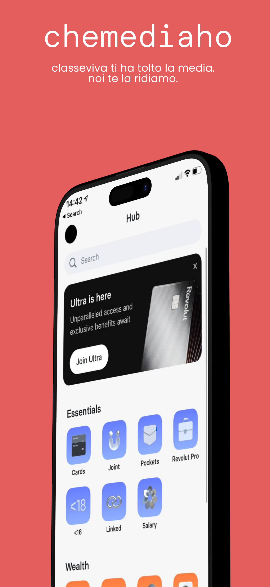
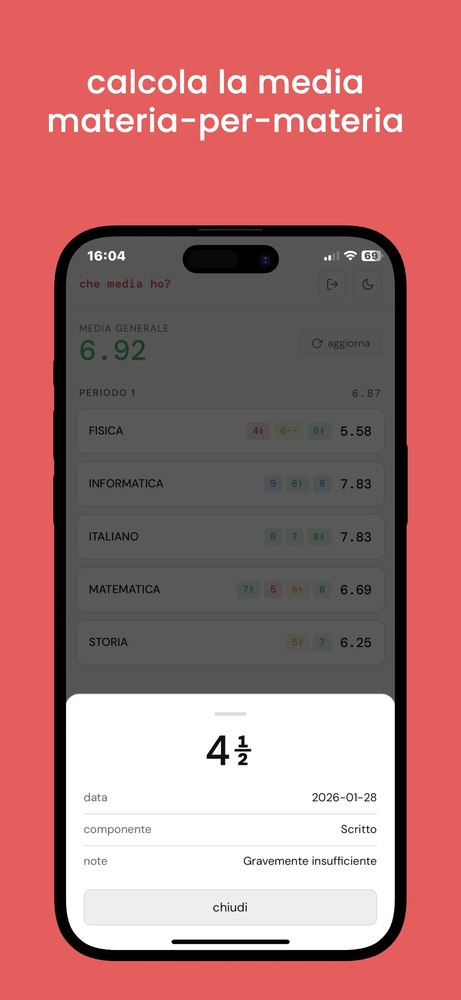
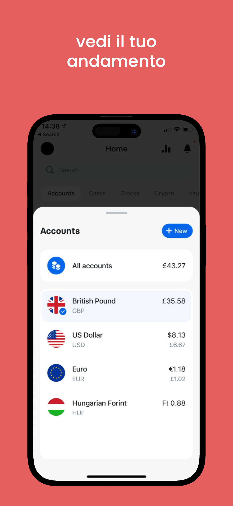
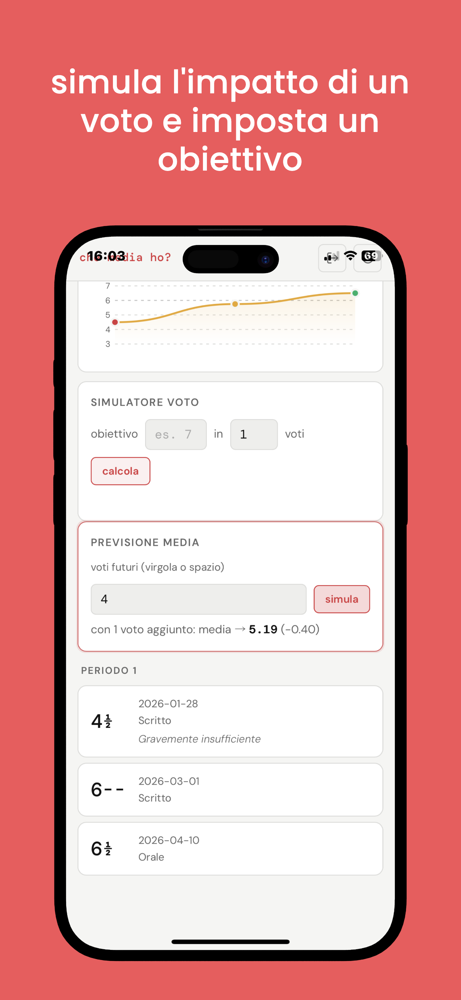
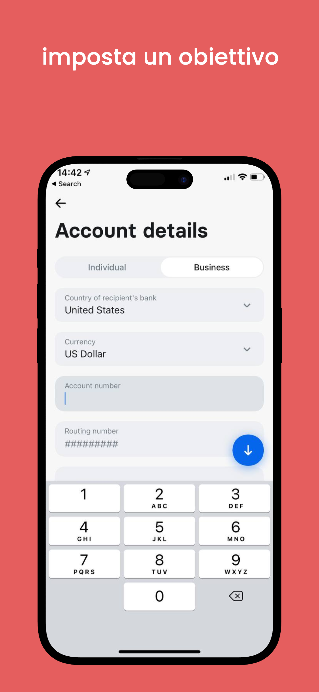

  

<h1 align="center">📊 che media ho?</h1>

  <b>la web app per calcolare la media dei voti su classeviva</b> 
  anche quando l'istituto ha disattivato la funzione ufficiale.

  
  
  
  

  
  
  

---

## 🧠 cos'è *che media ho?*

**che media ho?** è una semplice **web app flask**, self-hostabile via **docker**, che ti permette di:

- visualizzare la **media dei voti su classeviva**
- fare **simulazioni e previsioni**
- usare l'app anche **offline**
- installarla come **pwa** su smartphone

il tutto tramite una **ui chiara**, pulita e mobile-friendly.

---

## ✨ funzionalità

- 📱 **pwa (progressive web app)** — installabile su android e ios  
- 🔄 **supporto offline** — funziona anche senza connessione (con dati già scaricati)  
- 🎨 **design responsive** — perfetto su mobile e desktop  
- 📊 **calcolo automatico della media**  
- 🎯 **calcoli & previsioni** — scopri che voti ti servono per raggiungere un obiettivo  
- 📈 **grafici interattivi** — visualizza l'andamento nel tempo
- 🆓 **100% free & open source** — con controlli codeql  

---

## screenshot

  
  
  
  
  

---

## techy things

sei un dev e vuoi saperne di più? vai alla [wiki](https://github.com/open-viva/chemediaho/wiki/chemediaho-%E2%80%90-come-funziona,-setup).
vuoi sapere come l'app si interfaccia a classeviva? fai riferimento a questa [repo](https://github.com/open-viva/endpoints).

---

  <b>📚 studia meno i calcoli, pensa più ai voti.</b>

